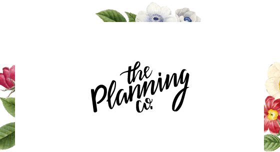
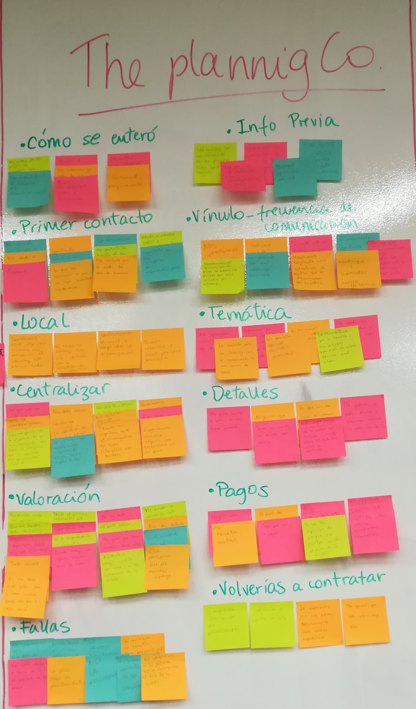
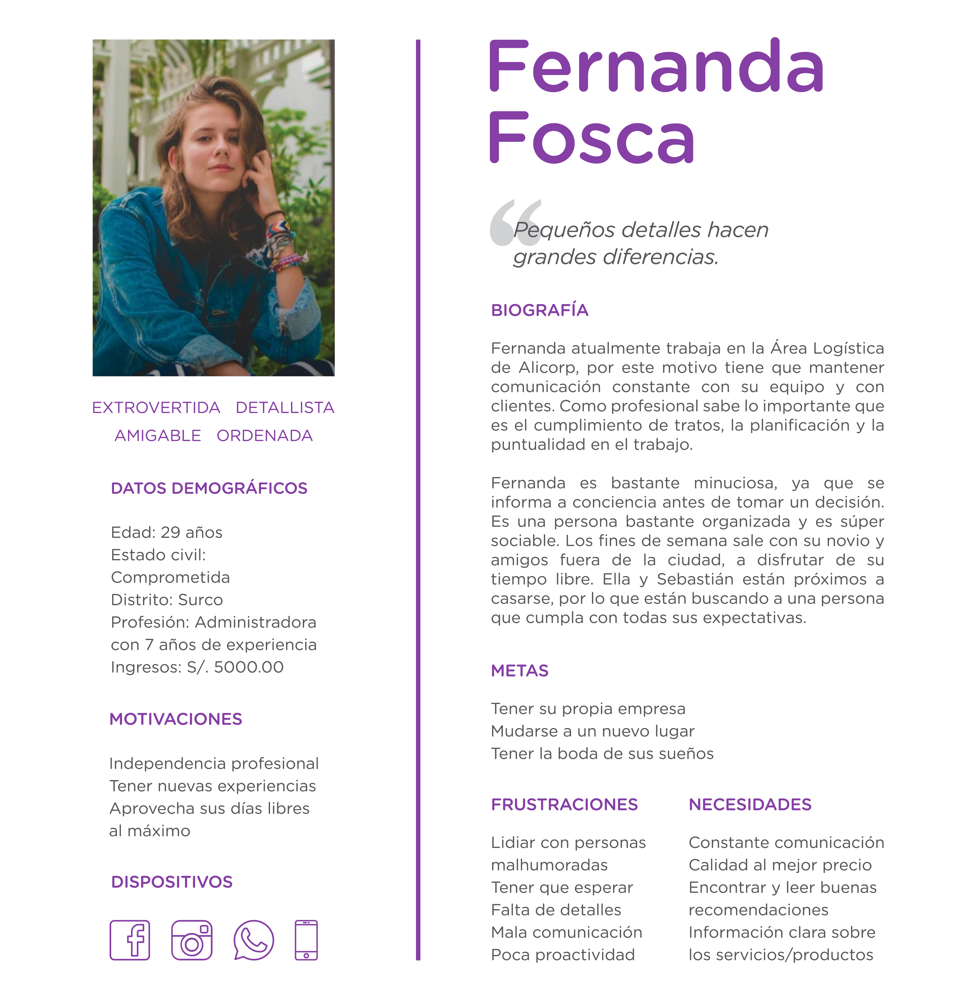
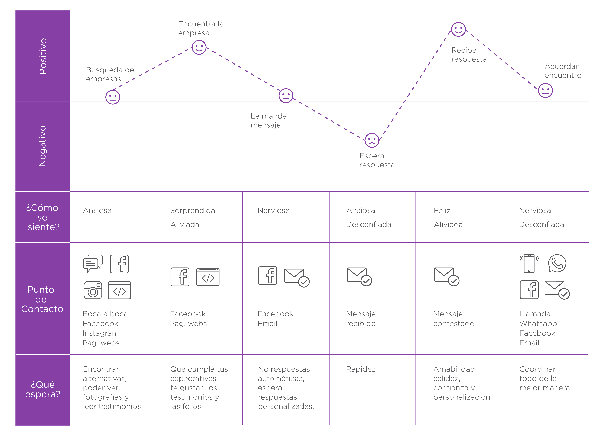

 # **PROYECTO: MARKETPLACE**

## Datos de la empresa

* Nombre: The Planning Co.
* Rubro: Organización de eventos
* Fundadora: Estrella Carbone Amprimo
* Fecha de creación: 22 de marzo de 2017 

## Historia de The Planning Co.

Estrella siempre estuvo ligada a la organización de eventos de alguna forma, su carrera, su especialización en Dirección de Arte y sus ganas de hacer las cosas diferentes la incentivaron a crear su propio emprendimiento llamado "The Planning Co."

"The Planning Co." se encarga de la organización y realización de eventos, Estrella te acompaña desde la creación del concepto hasta la elección de los detalles que harán que tu evento quede como lo pensaste desde un comienzo. Con apenas 2 años de creación, la empresa ha recibido muy buenas críticas, la mayoría de sus clientes llegan a ella por recomendaciones, siendo las redes sociales sus principales aliados para mostrar su trabajo y para entablar conversación con sus clientes.

***

## Objetivos a lograr

Nuestro principal objetivo es idear una página web, que responda a las necesidades de nuestros usuarios. Para esto debemos:
 
 - Conocer a los principales usuarios de The Planning Co. 
 - Investigar sobre cómo llegan a la página, qué es lo que buscan, qué información priorizan, qué dificultades tienen al momento de iniciar la comunicación.
 - Mostrar el trabajo que viene realizando la empresa usando fotos y testimonios de sus clientes.
 - Mejorar el canal de contacto, acortando tiempos de espera y mejorando la comunicación entre los posibles usuarios y la empresa.
 - Investigar sobre los medios de pago, de manera que sean una opción a implementarse.

## Nuestra implementación

Para llevar a cabo nuestra investigación, usamos las siguientes herramientas.

|Actividad|Descripción|Puntos|
|:----|:---|:---:|
|Entrevistas con cliente|Realización de entrevistas con el cliente (dueño del reto) y establecimiento de sus metas y objetivos.|25|
|Benchmark| Revisión de features de la competencia y referencias análogas. | 20 |
|Entrevistas con usuarios| Entrevistas en profundidad con al menos 5 usuarios. | 60 |
|Flujo / árbol de contenidos|Documento que estructura contenidos y su navegación|15|
|Testeos de prototipos| Sesiones de testing de la solución propuesta (baja, media y alta fidelidad) con al menos 5 usuarios por sesión. | 60 |
|Sketching y wireframing| Elaboración de prototipos de baja y mediana fidelidad. | 30 |
|Prototipado de alta fidelidad| Elaboración de prototipo en base a las pantallas diseñadas. | 80 |
TOTAL | | 290 |

[Archivo de implementación](https://docs.google.com/spreadsheets/d/13fslSvJjciGDpBU_I4s8i7acofkYHotPPmiNpHWxRAQ/edit?usp=sharing)

***
## **I. Descubrimiento e Implementación**

## 1. Entrevista con la fundadora

El primer paso fue acordar una entrevista con Estrella Carbone, para poder conversar sobre su emprendimiento, sus motivaciones, las dificultades que tuvo, entre más cosas que puedan ser de utilidad para nuestra investigación. 

### Documentación:

[Guía de preguntas](https://docs.google.com/document/d/1cK0dIuNJX3yavXMI4K80bfAuLg_sULZCr2uI83AEaVs/edit?usp=sharing)

[Transcripción de entrevista](https://docs.google.com/document/d/1opsd-hAs4KunrIXGw9SGTCgNL-WEgDObMdJbKrMdLz8/edit?usp=sharing)

### Problemas identificados:

* Si bien The Planning Co. apunta a crecer, quiere hacerlo sin perder su esencia y el valor por los detalles.
* Es importante para la fundadora trabajar de la mano con los clientes en la elaboración de una temática propia para su evento.
* Actualmente trabaja solo con una persona, por lo que necesitan organizarse mejor. 
* Hay mucha competencia en el rubro, por lo que tiene que destacarse de las demás empresas.
* Algunos clientes solicitan respuestan rápidas cuando preguntan por los servicios, porque al ser eventos personalizados la elaboración de presupuestos toma mucho tiempo. 
* Si bien ofrece la organización de eventos sociales y eventos corporativos, el servicio que más demanda tiene es la organización de matrimonios. 
* Todavía no cuenta con página web, siendo las redes sociales los medios principales de comunicación.

### Puntos a favor de The Planning Co:

* Nivel de personalización, se destaca la frase "Todo evento se puede personalizar".
* Compromiso y responsabilidad con cada evento que se realiza.
* Trabajo con proveedores de confianza y el valor por los detalles.
* Calidad de fotografía en sus redes sociales.
* Testimonios de antiguos clientes.

## 2. Benchmark

En el siguiente cuadro se observa a 7 empresas (The Planning Co y 6 Empresas de la competencia), las cuales fueron seleccionadas de acuerdo a las características y al rubro elegido.
La finalidad del benchmark, era ver cómo empresas del mismo rubro mostraban sus servicios, cuáles eran sus puntos fuertes y que era lo que diferenciaba a cada una. 

### Conclusiones:

* Sólo 4 de 7 páginas cuentan con una web propia, todas tienen redes sociales
* Solo dos empresas realizan todo tipo de eventos, las demás sólo son para matrimonios.
* Es importante tener una galería que  muestre el trabajo realizado, la calidad de las fotos es necesaria.
* No todas las que cuentan con página web propia muestran los testimonios de sus usuarios.
* Los medios de contacto suelen ser por inbox, correo electrónico y whatsapp.
* No se habla sobre los medios de pago.

[Cuadro de benchmark](https://docs.google.com/document/d/1w6b31SlVHk4gDb-FgCNkttX6m84rWFNfvgQlNgFt28c/edit?usp=sharing)

## 3. Entrevista con usuarios o posibles usuarios

### Documentación:

Realizamos entrevistas a usuarios de The Planning Co, a usuarios de otras empresas del mismo rubro y a posibles usuarios. 

[Guía de preguntas](https://docs.google.com/document/d/11FKW2_KS9SP7N_OV2i3IFm_FnWZJZp1YY1NjrAwM3wo/edit?usp=sharing)

[Transcripción de entrevistas](https://drive.google.com/drive/folders/1jWi28VIiO13-T4cyFbcFsF76gyCuoLDB?usp=sharing)

### Problemas identificados:

* Usuarios necesitan investigar el servicio que contratan, por eso recurren a sus redes sociales o a su página web.
* Valoran ver los trabajos previos y leer sobre las experiencias de otros usuarios.
* Buscan respuestas rápidas y que el trato sea amable.
* Buscan el servicio integral, esto quiere decir que una persona puedan encargarse de muchas cosas.
* Buscan opciones de pago.

*** 
## **II. Síntesis y Definición**

## 1. Affinity Map

Luego de realizar las entrevistas, procedemos a elaborar el affinity map con la finalidad de agrupar y categorizar temas recurrentes.

[Fotos del proceso](https://drive.google.com/drive/folders/1LQZ9N5EmxvCj-qEgPnbVRDLF7Fftomkg?usp=sharing)

[Conclusiones de cada grupo](https://docs.google.com/document/d/1I-827wTCDihv86KVXPfuZX7o0oDNL_amCQqDM9l9INI/edit?usp=sharing)

Realizamos 6 entrevistas en total, de las cuales 2 fueron a usuarios de The Planning Co, 3 usuarios de la competencia y 1 a una posible usuaria. Una vez terminadas las entrevistas, analizamos los resultados y los dividimos en 12 grupos, los cuales son:

| Grupo 1 | Grupo 2 | Grupo 3 |
| ------ |---------| ------|
| Cómo se entero  | Lugar  | Valoración    |
| Información previa  | Temática   | Pagos   |
| Primer contacto | Centralizar | Fallas|
| Frecuencia de comunicación | Detalles | Volverías a contratar  |

### Principales conclusiones:

* Son importantes las reuniones presenciales, para ver el interés y la confianza.
* Es importante alguien que te oriente con el concepto y la temática del evento. 
* Es importante ver fotos de eventos previos y leer sobre experiencias de otros usuarios.
* Que sea puntualidad es importante.
* Valoran que se respete el presupuesto y se den opciones para pagos.
* Se valoran respuestas rápidas y personalizadas.

## 2. User Persona

Con las entrevistas y la elaboración del affinity map, creamos una user persona principal llamada **Fernanda Fosca**. La cual representa a todos nuestros posible usuarios, representa sus frustraciones, motivaciones, sus datos demográficos, etc.

## 3. Customer Journey Map

Esta herramienta nos sirvió para identificar y solucionar los puntos relevantes del viaje del usuario. Los puntos a enfocarnos son: la búsqueda de información, la comunicación entre el cliente y la empresa, los medios de pago y el servicio personalizado.

[Proceso del Customer Journey Map](https://drive.google.com/open?id=13whu8XL7CGXEO2hLvr0Ose10GZl_KkQF)

## 4. Problem Statements

Se obtuvo 7 **Problem Statements** de los cuales se priorizó 4, los cuáles son lo siguientes:

### **
{Persona} necesita una manera {necesidad}, porque/para {insight}.
**

* Fernanda, quien está a punto de casarse, necesita conocer el trabajo de la organizadora de eventos para poder confiar en su trabajo.

* Fernanda necesita de alguien que se encargue de la organización integral del evento para que ella pueda disfrutar de ese día especial. 

* Fernanda necesita conversar sobre sus ideas con la organizadora para poder decidir si trabaja con ella.

* Fernanda necesita respuestas rápidas sobre los detalles de su evento  para tomar decisiones rápidas y acertadas.

[Problem Statements](https://drive.google.com/open?id=1x6rY_HRmdDT1KYEqgKB0BK9pd0CWBvzZ)

## 5. How Might We

Una vez obtenido los **Problem Statements** se pasó a realizar los **How Might We** de cada uno de ellos.

**Fernanda, quien está a punto de casarse, necesita conocer el trabajo de la organizadora de eventos para poder confiar en su trabajo.**

* ¿HMW hacer que la organizadora muestre su servicio?

* ¿HMW transformar la desconfianza en curiosidad?

* ¿HMW aminorar las dudas de Fernanda?

**Fernanda necesita de alguien que se encargue de la organización integral del evento para que ella pueda disfrutar de ese día especial.** 

* ¿HMW hacer que la experiencia del evento sea buena?

* ¿HMW ayudar a Fernanda a estar segura que su evento se desarrollará sin contratiempos?

* ¿HMW incluir una sensación de seguridad en el evento?

* ¿HMW tener bajo control los acontecimientos que puedan suceder en el evento?

**Fernanda necesita conversar sobre sus ideas con la organizadora para poder decidir si trabaja con ella.**

* ¿HMW hacer que Fernanda se comunique con la organizadora de eventos?

* ¿HMW hacer que Fernanda comunique sus necesidades?

**Fernanda necesita respuestas rápidas sobre los detalles de su evento  para tomar decisiones rápidas y acertadas.**

* ¿HMW hacer que la espera sea la parte más emocionante del evento?

* ¿HMW hacer que la espera no sea estresante?

* ¿HMW hacer que Fernanda tenga los detalles del evento en corto tiempo?

[Problem statements & HMW](https://docs.google.com/document/d/1003DVb0eyXucUHII78r4KYoLY84m63IzVX1d27HTlp8/edit?usp=sharing)

***

## **III. Ideación**

## 1. Benchmark & Referencias

Para poder empezar a construir los **Sketches**, se realizó el Benchmark de las páginas web del rubro de las empresas que se dedican a la Organización de Eventos, las cuales se muestran a continuación:

**D ANDRE**

**BACKYARD**

**ERIKA FERNANDEZ**

**SILVANA PAZ**

[Benchmarking & Referencias](https://drive.google.com/open?id=1JH9e-BA2qoxe_kWMc0mhWI1pwa-d8Tpn)

## 2. Mapa de Sitio

Una vez realizado el **Benchmarking** de las empresas que tienen una página web, se pasó a realizar el **Mapa de Sitio**, ya que es muy importante para conocer que deberíamos de considerar al momento de realizar los **Sketches**.

## 3. Crazy 8s

Esta herramienta se realizó para ver las posibilidades que se tiene para armar el contenido de todos los **Sketches**

**INICIO**

**NOSOTROS**

**NUESTROS SERVICIOS**

**GALERIA**

**TESTIMONIOS**

**CONTACTO**

[Crazy 8s](https://drive.google.com/open?id=1WlARFikQdAN5YS2azj8N_1EC8pc7WGI4)

## 4. Sketches

Se realizó los sketches teniendo en cuenta todo lo recopilado en **Descubrimiento e Implementación** y en **Síntesis y Definición** y así entender que es lo que necesita el usuario.

**INICIO**

**NOSOTROS**

**NUESTROS SERVICIOS**

**GALERIA**

**TESTIMONIOS**

**CONTACTO**

[Sketches](https://drive.google.com/open?id=1FiIxe95MT1AkO0ylSwkBdG1_sPZ2GlMJ)

## 5. User Flow

Se realizó el User Flow para observar cuáles son las posibles interacciones que se generan entre los **Sketches** y el usuario.

## 6. User Testing

Se realizó 3 testeos de los **Sketches**, 1 posible usuaria y 2 usuarias de la competencia. Llegando a las siguientes conclusiones:

* En la pantalla de Nuestros Servicios, los íconos que se encuentran arriba de cada imagen ahora pasarán al costado en forma de una lista.
* La pantalla de Testimonios, mostrará los comentarios de los 3 rubros que son: Matrimonios, Sociales y Corporativos; y no todo unido como en el Sketch presentado.

**INICIO**

**NUESTROS SERVICIOS**

**TESTIMONIOS**

**CONTACTO**

[User Testing (Entrevistas - Tareas)](https://drive.google.com/open?id=1laXUpH4CMEJEjGm_o004WsutWRitueOE)

[Sketches - Propuesta de Cambio](https://drive.google.com/open?id=1agobG_kLI1AAwYC_4wB-iEVwF1xrGLJf)

## 7. Prototipo de Media Fidelidad

Al concluir con el **User Testing** de los **Sketches**, pasamos a realizar el **Prototipo de Media Fidelidad** con las sugerencias que nos dieron los usuarios.

**INICIO**

**NOSOTROS**

**NUESTROS SERVICIOS**

**GALERIA**

**TESTIMONIOS**

**CONTACTO**

[Prototipo de Media Fidelidad](https://marvelapp.com/3iff6d0/screen/56904038)

## 8. User Testing - Prototipo de Media Fidelidad

Se realizó 5 testeos del **Prototipo de Media Fidelidad**, 3 posibles usuarias y 2 usuarias de la competencia. Llegando a las siguientes conclusiones:

* En la página de Inicio, en la sección de Nuestros Servicios agregar un botón que te dirija a esa página.
* En la página de Nosotros debería tener la opción de ir a Contacto.
* Reducir los pasos en la página de Contacto.

[User Testing - Prototipo de Media Fidelidad (Entrevistas - Tareas)](https://drive.google.com/open?id=1vsJBtaQRt8pEoHVoYb4KGcLCalaztESP)

***

## **IV. Prototipado**

## 1. Prototipo Alta Fidelidad

Luego de plantear e iterar los prototipos de baja y media fidelidad, definimos nuestro prototipo de alta. Al elaborarlo decidimos qué colores usar, las tipografías, iconos y otros elementos visuales que mantendrían la identidad de The Planning Co. y fortalecerían su imagen frente al público.

**INICIO**

**NOSOTROS**

**NUESTROS SERVICIOS**

**GALERIA**

**TESTIMONIOS**

**CONTACTO**

[Prototipo de Alta Fidelidad](https://marvelapp.com/bgh8e07/screen/57012457)

***

## **V. User Testing**

Se realizó 5 entrevistas del **Prototipo de Alta Fidelidad** a posibles usuarios de **The Planning Co**, dándoles las siguientes tareas:

* Ingresar a la página Nuestros Servicios
* Ingresar a la página de Galería
* Ingresar a la página de Testimonios
* Contactar a The Planning Co
* Ingresar a la página de Nosotros
* Volver a la página principal

Terminada las entrevistas se pudo sacar las siguientes conclusiones, las cuales se tendrán en cuenta para poder realizar el maquetado en HTML.

* Añadir el la lista del menú un botón para regresar a la Pantalla de Inicio.
* Al costado de cada servicio, colocar un botón que te dirija a la pantalla de Contacto.
* En la pantalla Contacto considerar 2 opciones: Comunicación directa y Rellenado de Formulario.

[User Testing](https://drive.google.com/open?id=12I_0H2iXbE6H18g-Uh5gPq3a-Bv1HWPJ)

***

## **VI. Conclusiones**

**¿Cómo los contenidos y funcionalidades responden a los objetivos del proyecto?**

**¿Cómo los contenidos y funcionalidades resuelven cada uno de las necesidades del usuario final?**

***

## **VII. Documentación extra**

[Link de video en LOOM]()

[Link carpeta de trabajo en Drive](https://drive.google.com/drive/folders/1nzr4TB5-zIKcnTcLqft7vHeyXYVZrWRA?usp=sharing)

[Link de prototipo en Zeplin](zpl.io/aX3dm8K)

